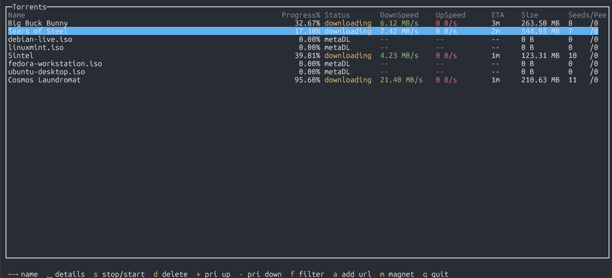
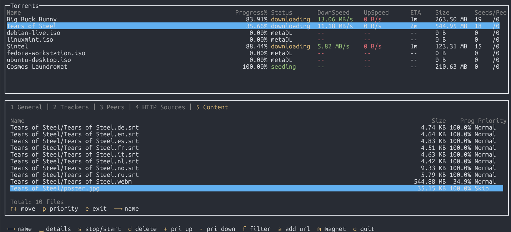
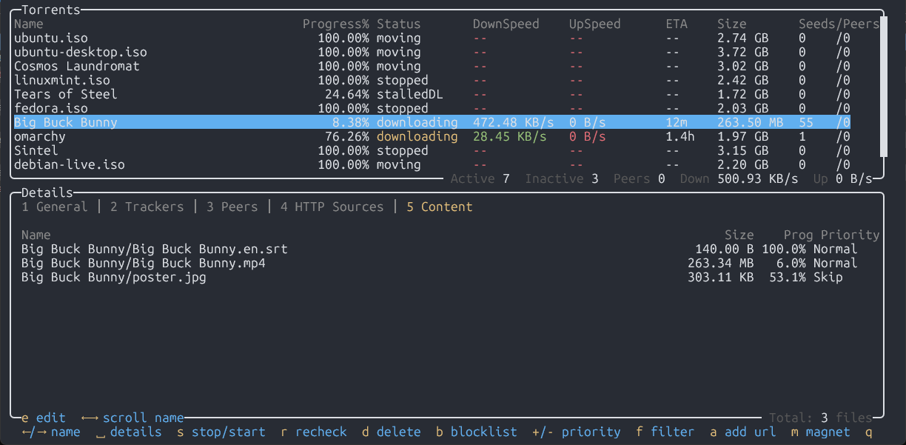

# qBitty

A terminal UI client for qBittorrent, built with Go and [gocui](https://github.com/awesome-gocui/gocui).

## Screenshots

Terminal captures from **2026-03-30** (bundled under [`docs/screenshots/`](docs/screenshots/)):

**Main torrent list** — status, speeds, and columns; long torrent names can be scrolled horizontally with **←** / **→** when the name does not fit the column.



**Details pane, Content tab — file priority edit mode** — press **`e`**, use **↑** / **↓** to choose a file, **`p`** to cycle priority; **←** / **→** scroll long file paths in the Name column.



**Details pane, Content tab — browse mode** — **`e`** enters edit mode; **←** / **→** scroll the selected file name when paths are wider than the column.



## Features

- Real-time torrent list with status, progress, speeds, ETA, size, and seed/peer counts
- **Long names:** **←** / **→** scroll the torrent name in the list (when it exceeds the Name column). On the **Content** tab, the same keys scroll the file path for the selected row (after **`e`**, the highlighted file row).
- Split-pane details view with 5 tabs (matching the qBittorrent WebUI):
  - **General** -- transfer info, speeds, connections, dates, piece info
  - **Trackers** -- tracker URLs, status, seed/peer/leech counts
  - **Peers** -- connected peers with client, speed, country info
  - **HTTP Sources** -- web seed URLs
  - **Content** -- file list with size, progress, and priority; **`e`** enters edit mode to change per-file priority (**`p`** cycles Skip → Normal → High → Maximum)
- Filter torrents by status and/or category
- Torrent actions: stop/start, delete, increase/decrease priority
- Add new torrents by URL or magnet link
- Auto-refreshes every second
- **When qBittorrent is unreachable or login fails**, the app stays open with a short explanation, an empty list, **`r`** to retry manually, and (for connection issues) a **10s countdown** before automatic retry

### What’s new in v0.7.0

- **First-launch setup wizard** — If **qBittorrent URL, username, or password** is missing after loading config and env, run with **`QBITTY_WIZARD=1`**, **`WIZARD=1`**, or **`--wizard`** for interactive prompts. Values are saved to **`~/.config/qbitty/config.json`** (or **`$XDG_CONFIG_HOME/qbitty/config.json`** when set). The wizard optionally asks for **Sonarr** and **Radarr** URLs and API keys; answering **no** skips *arr and leaves those keys out of the file.
- **Sonarr / Radarr status in the torrent list** — For torrents in category **`Sonarr`** or **`Radarr`**, the **Status** column can show *arr pipeline state (for example **import pending**, **importing**) when the download is tracked in that app’s queue and past active client download. Other categories are unchanged. Queue data is refreshed about every **10 seconds** (qBittorrent still refreshes every second).
- **Quieter optional *arr** — Sonarr/Radarr HTTP clients are only enabled when the URL is valid **`http`/`https`** with a host **and** an API key is set. Failed queue fetches no longer spam **stderr** (they keep the last good snapshot).

Earlier releases: **v0.6.0** added *arr blocklist via **`b`** and stricter config loading; **v0.5.0** added details title, Content footer on the frame, scrollbars, and shortcut bar tweaks. See **`RELEASE_NOTES.md`** for full notes.

## Requirements

- **From source:** Go 1.22+
- A running qBittorrent instance with the WebUI API enabled

## Installation

### Homebrew (recommended)

If you use a custom tap that ships this formula (for example `thatcraigw/tap` from [`homebrew-tap`](https://github.com/thatCraigW/homebrew-tap)):

```bash
brew tap thatcraigw/tap
brew install qbitty
```

Upgrade after a new release:

```bash
brew update
brew upgrade qbitty
```

If your tap path differs, replace `thatcraigw/tap` with the name you used with `brew tap`.

### Build from source

```bash
go build -o qbitty .
```

Install the binary somewhere on your `PATH` if you want to run `qbitty` from anywhere.

## Configuration

qBitty loads credentials from a **config file** first, then applies any **environment variable** overrides on top. This means you can use either method (or both).

### First-time setup (wizard)

If **any** of **url**, **username**, or **password** is still empty after reading the config file and env, you can run an interactive setup instead of creating **`config.json`** by hand:

```bash
QBITTY_WIZARD=1 qbitty
# or: WIZARD=1 qbitty
# or: qbitty --wizard
```

You will be prompted for qBittorrent Web UI URL, username, and password (password is hidden). Then you can choose whether to add **Sonarr** and **Radarr** (base URL + API key each). Answering **no** skips that app and omits those keys from the saved file. The file is written with mode **`600`**.

### Config file (recommended)

Create `~/.config/qbitty/config.json`. Below are copy-paste-friendly examples (2-space indentation).

**qBittorrent only** (required keys):

```json
{
  "url": "https://localhost:8080",
  "username": "admin",
  "password": "your-password"
}
```

**With optional Sonarr / Radarr** (for **`b`** blocklist when qBittorrent categories are `Sonarr` or `Radarr`; omit any block you do not use):

```json
{
  "url": "https://localhost:8080",
  "username": "admin",
  "password": "your-password",

  "sonarr_url": "http://127.0.0.1:8989",
  "sonarr_api_key": "your-sonarr-api-key",

  "radarr_url": "http://127.0.0.1:7878",
  "radarr_api_key": "your-radarr-api-key"
}
```

If `sonarr_*` / `radarr_*` are omitted, **`b`** still offers to remove the torrent from qBittorrent only.

Restrict permissions so only your user can read it:

```bash
chmod 600 ~/.config/qbitty/config.json
```

### Environment variables (alternative / override)

You can use environment variables instead of a config file, or to override individual values from the config file:

| Variable           | Description                                      | Example                    |
|--------------------|--------------------------------------------------|----------------------------|
| `QB_URL`           | qBittorrent WebUI URL                            | `https://localhost:8080`   |
| `QB_USER`          | WebUI username                                   | `admin`                    |
| `QB_PASS`          | WebUI password                                   | `adminadmin`               |
| `SONARR_URL`       | Sonarr base URL (optional; blocklist via **`b`**) | `http://localhost:8989`    |
| `SONARR_API_KEY`   | Sonarr API key (**Settings → Security**)         |                            |
| `RADARR_URL`       | Radarr base URL (optional; blocklist via **`b`**) | `http://localhost:7878`    |
| `RADARR_API_KEY`   | Radarr API key (**Settings → Security**)       |                            |
| `QBITTY_WIZARD`    | If **`1`** / **`true`** / **`yes`** / **`on`**, run interactive setup when qB credentials are incomplete (same as **`--wizard`**) | |
| `WIZARD`           | Same as **`QBITTY_WIZARD`** (either variable works) | |

### Resolution order

1. Read the first config file that exists, in this order: `$XDG_CONFIG_HOME/qbitty/config.json` (when `XDG_CONFIG_HOME` is set), then `~/.config/qbitty/config.json`. (If `XDG_CONFIG_HOME` points somewhere other than `~/.config`, your file under `~/.config` is still tried second.)
2. Override with environment variables (if set): `QB_*`, and optionally `SONARR_*` / `RADARR_*`.

Invalid JSON in the config file is reported at startup (it is not ignored). Required qBittorrent keys are `url`, `username`, `password` in JSON (not `QB_URL`-style names). Optional keys are `sonarr_url`, `sonarr_api_key`, `radarr_url`, `radarr_api_key`.

This is useful if you want to keep your URL and username in the config file but pass the password via an env var for extra safety.

### HTTPS and connection security

qBitty will warn if the configured URL uses plain HTTP, since credentials are sent in cleartext. There are a few approaches depending on your setup:

**Localhost only (HTTP is fine)** — If qBittorrent and qBitty run on the same machine, `http://localhost:8080` is safe. Traffic on localhost never leaves your machine, so there is nothing to intercept.

**Self-signed certificate** — To enable HTTPS on the qBittorrent WebUI, generate a self-signed cert and configure it in *Tools > Options > Web UI > Use HTTPS*:

```bash
openssl req -x509 -newkey rsa:2048 -keyout qbt-key.pem -out qbt-cert.pem -days 3650 -nodes -subj "/CN=localhost"
```

Then point the WebUI settings to `qbt-cert.pem` and `qbt-key.pem`.

**OrbStack / Docker** — If qBittorrent runs in an OrbStack or Docker container, you can use OrbStack's built-in HTTPS support (e.g. `https://qbittorrent.orb.local`) which provides a trusted local certificate automatically, avoiding self-signed cert hassle.

## Usage

```bash
# Launch the TUI (config file)
qbitty
# or, from the build directory: ./qbitty

# Or with env vars
QB_URL=https://localhost:8080 QB_USER=admin QB_PASS=secret qbitty

# Dump raw torrent JSON to stdout (still exits on login failure)
qbitty --dump-json

# Interactive config when url / username / password are missing (see "First-time setup")
QBITTY_WIZARD=1 qbitty
```

## Keyboard Shortcuts

| Key         | Action                                                                 |
|-------------|------------------------------------------------------------------------|
| `Up/Down`   | Navigate torrent list; on **Content** tab with **`e`** edit on, move file row |
| `Space`     | Toggle details pane                                                    |
| `1-5`       | Switch details tab (opens pane if closed)                              |
| `Left/Right`| Scroll long **names** (torrent list or **Content** tab file path) when they overflow; otherwise switch details tab (see below) |
| `s`         | Stop/start selected torrent                                            |
| `d`         | Delete selected torrent (with confirmation)                            |
| `b`         | Blocklist in Sonarr/Radarr (if configured) or remove from qBittorrent only (see config) |
| `+` / `-`   | Increase/decrease queue priority                                       |
| `e`         | On **Content** tab: toggle file-priority edit (`e` again to exit)      |
| `p`         | In file edit mode: cycle priority (Skip → Normal → High → Maximum)   |
| `f`         | Filter by status and/or category                                       |
| `a`         | Add torrent by URL                                                     |
| `m`         | Add torrent by magnet link                                             |
| `r`         | When the connection/login banner is visible: retry now                 |
| `q`         | Quit                                                                   |

**Details tab navigation with `Left` / `Right`:** On the **Content** tab (**5**), **←** / **→** scroll the file name first when the path is longer than the column; at the ends of the scroll (or if the name fits), **←** moves to the previous tab and **→** scrolls the torrent name in the main list (there is no tab to the right of Content). On other tabs, **←** / **→** move between tabs as before.

## License

MIT
