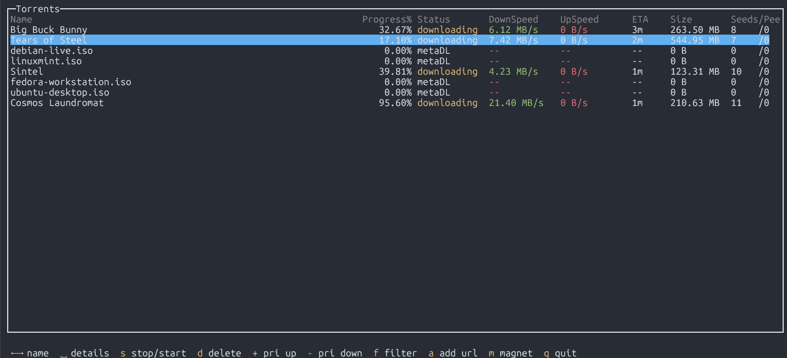
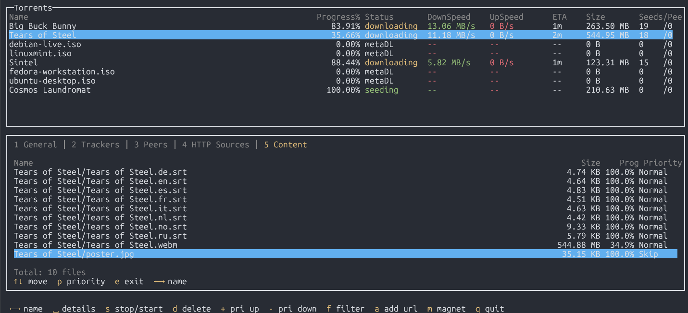
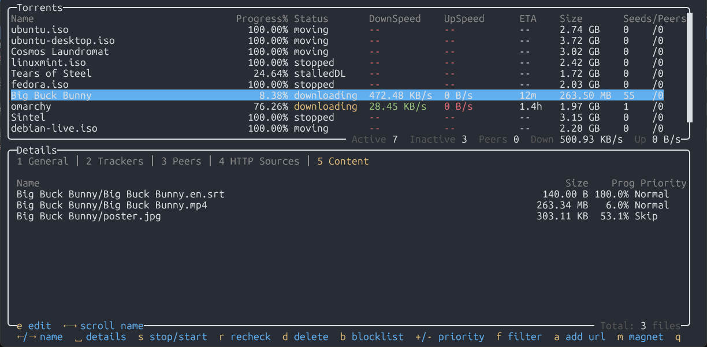

# qBitty

A terminal UI client for qBittorrent, built with Go and [gocui](https://github.com/awesome-gocui/gocui).

## Screenshots

Terminal captures from **2026-03-30** (bundled under [`docs/screenshots/`](docs/screenshots/)):

**Main torrent list** — status, speeds, and columns; long torrent names can be scrolled horizontally with **←** / **→** when the name does not fit the column.



**Details pane, Content tab — file priority edit mode** — press **`e`**, use **↑** / **↓** to choose a file, **`p`** to cycle priority; **←** / **→** scroll long file paths in the Name column.



**Details pane, Content tab — browse mode** — **`e`** enters edit mode; **←** / **→** scroll the selected file name when paths are wider than the column.



## Features

- Real-time torrent list with status, progress, speeds, ETA, size, and seed/peer counts
- **Long names:** **←** / **→** scroll the torrent name in the list (when it exceeds the Name column). On the **Content** tab, the same keys scroll the file path for the selected row (after **`e`**, the highlighted file row).
- Split-pane details view with 5 tabs (matching the qBittorrent WebUI):
  - **General** -- transfer info, speeds, connections, dates, piece info
  - **Trackers** -- tracker URLs, status, seed/peer/leech counts
  - **Peers** -- connected peers with client, speed, country info
  - **HTTP Sources** -- web seed URLs
  - **Content** -- file list with size, progress, and priority; **`e`** enters edit mode to change per-file priority (**`p`** cycles Skip → Normal → High → Maximum)
- Filter torrents by status and/or category
- Torrent actions: stop/start, **force recheck** (**`r`**), delete, increase/decrease priority
- Add new torrents by URL or magnet link
- Auto-refreshes every second
- **When qBittorrent is unreachable or login fails**, the app stays open with a short explanation, an empty list, **`r`** to retry manually, and (for connection issues) a **10s countdown** before automatic retry

### What’s new in v0.8.1

- **qBittorrent 5.2+** — Login and empty **POST** responses accept **HTTP 204** as well as the older **200** behavior, so qBitty works with qBittorrent’s Web API after the 5.2 status-code changes.

**v0.8.0** added **force recheck** (**`r`** on the torrent list). Earlier releases: **v0.7.0** brought the first-launch wizard, Sonarr/Radarr status in the list, and quieter optional *arr. **v0.6.0** added *arr blocklist via **`b`** and stricter config loading. See **`RELEASE_NOTES.md`** for full notes.

## Requirements

- **From source:** Go 1.22+
- A running qBittorrent instance with the WebUI API enabled

## Installation

### Homebrew (recommended)

If you use a custom tap that ships this formula (for example `thatcraigw/tap` from [`homebrew-tap`](https://github.com/thatCraigW/homebrew-tap)):

```bash
brew tap thatcraigw/tap
brew install qbitty
```

Upgrade after a new release:

```bash
brew update
brew upgrade qbitty
```

If your tap path differs, replace `thatcraigw/tap` with the name you used with `brew tap`.

### Build from source

```bash
go build -o qbitty .
```

Install the binary somewhere on your `PATH` if you want to run `qbitty` from anywhere.

## Configuration

qBitty loads credentials from a **config file** first, then applies any **environment variable** overrides on top. This means you can use either method (or both).

### First-time setup (wizard)

If **any** of **url**, **username**, or **password** is still empty after reading the config file and env, you can run an interactive setup instead of creating **`config.json`** by hand:

```bash
QBITTY_WIZARD=1 qbitty
# or: WIZARD=1 qbitty
# or: qbitty --wizard
```

You will be prompted for qBittorrent Web UI URL, username, and password (password is hidden). Then you can choose whether to add **Sonarr** and **Radarr** (base URL + API key each). Answering **no** skips that app and omits those keys from the saved file. The file is written with mode **`600`**.

### Config file (recommended)

Create `~/.config/qbitty/config.json`. Below are copy-paste-friendly examples (2-space indentation).
**qBittorrent with API key** (required keys; alternative to username/password):
```json
{
  "url": "https://localhost:8080",
  "api_key": "your-qbittorrent-api-key"
}
```

**Or qBittorrent with username/password** (classic auth, still works):
```json
{
  "url": "https://localhost:8080",
  "username": "admin",
  "password": "your-password"
}
```

**With optional Sonarr / Radarr** (for **`b`** blocklist when qBittorrent categories are `Sonarr` or `Radarr`; omit any block you do not use):

Restrict permissions so only your user can read it:

```bash
chmod 600 ~/.config/qbitty/config.json
```

### Automatic detection of media-less grabs (optional)

Sonarr and Radarr sometimes grab a release whose payload contains no video at all — just
an `.exe`, an archive, or a disc image. qBitty can spot these and record them for you.

Add an `autoblock` block to `config.json`:

```json
{
  "autoblock": {
    "mode": "log"
  }
}
```

**Modes**, in increasing order of autonomy:

| Mode   | Behavior |
|--------|----------|
| `off`  | Default. No scanning. |
| `log`  | Records what it *would* blocklist to an audit log. Nothing is removed or blocklisted. |
| `flag` | Also marks suspicious torrents in the list and details pane, so you can review the evidence and blocklist with **`b`**. Still nothing automatic. |
| `auto` | Blocklists via Sonarr/Radarr automatically, capped at `max_per_hour`. Everything `flag` shows still applies. |

**Start with `log`** and read the audit log for a week before promoting the mode. Detection
is deliberately conservative — a torrent is only suspicious when **all** of these hold:

- its category is `Sonarr` or `Radarr`
- its file list is known (metadata has arrived) and it is past the grace window
- it contains **no** media file at or above `min_media_bytes` — this size floor is what
  defeats the common trick of padding an `.exe` with a tiny decoy `.mkv`
- it contains **at least one** file with a banned extension (executables, scripts,
  archives, disc images including `.iso`, and `.ts`)

`.ts` is the one banned extension that is not malware. A transport stream is genuine
video, but if your player cannot open one, a release delivered as `.ts` is just as
unusable as an executable — so it is excluded from the media list and banned instead.
The related `.m2ts` and `.mts` containers are *not* banned; add them to
`banned_extensions` (and drop them from `media_extensions`) if your player rejects those
too. An extension in both lists never triggers a ban, since media is counted first.

Requiring two independent signals is what keeps ordinary releases safe: a normal season
pack full of `.srt`, `.nfo` and `.txt` files trips nothing, because it also contains real
video. Note that qBittorrent's own **Excluded file names** list is *not* used for this —
it mixes cosmetic junk (`.txt`, `.jpg`) with genuine malware indicators, so matching it
would flag almost every legitimate release.

**What `flag` mode shows** — a flagged torrent's **Status** column reads `NO MEDIA` in red,
replacing the qBittorrent/*arr status. That replacement is the point: Sonarr will happily
report `Downloading` or `Importing` for a payload it can never import, and that is exactly
the misleading part. The details pane lists the offending file names underneath.

Pressing **`b`** on a flagged torrent works as it always has, except the confirmation
dialog now lists the banned files first, so you approve the blocklist against the actual
file list rather than a bare warning. Confirmed blocklists on flagged torrents are written
to the audit log as `blocklisted` (or `error`), so the log shows what became of each
finding and not merely that it was found.

**What `auto` mode does** — every finding that Sonarr/Radarr still has a queue row for is
blocklisted there automatically (`DELETE /api/v3/queue/{id}` with `removeFromClient=true`
and `blocklist=true`) — the same call **`b`** makes, so the release is blocklisted *and*
removed from qBittorrent, and the *arr searches for a replacement. The queue row is looked
up fresh at the moment of the call, so a stale id can never blocklist the wrong release.

Three things bound it:

- **`max_per_hour`** (default 5) is a rolling-hour cap on blocklist calls. If the rule is
  ever wrong, it can be wrong about five releases an hour, not your whole queue. Findings
  past the cap are logged as `skipped_rate_cap` and retried on a later tick once a slot
  frees — they are held, not dropped.
- **Findings *arr no longer tracks** are never acted on. They are logged as
  `detected_no_arr`, because without a queue row there is nothing to blocklist.
- **A failed blocklist is not retried.** It is logged as `error` with the cause, and the
  torrent stays flagged so you can decide with **`b`**. The usual causes — the queue row
  vanished, the release was already handled — do not improve with repetition.

Run `log` for a while first and read the audit log. Promoting straight to `auto` means
trusting the rule against your indexers before you have seen it judge them.

**Audit log** — one JSON object per line, at `$XDG_STATE_HOME/qbitty/autoblock.log`
(default `~/.local/state/qbitty/autoblock.log`):

```json
{"time":"2026-08-30T18:07:44Z","mode":"log","action":"detected","hash":"a1b2…","name":"Some.Release.S01E01","category":"Sonarr","total_files":1,"media_files":0,"banned_files":["payload.exe"],"queue_id":42}
```

`action` is one of:

| Action | Meaning |
|--------|---------|
| `session_start` | qBitty began watching. Gaps between these show when nothing was watched — the scan only runs while qBitty is open. |
| `detected` | Suspicious, and Sonarr/Radarr still tracks it. In `log`/`flag` modes this is the whole record. |
| `detected_no_arr` | Suspicious, but the *arr queue entry is gone, so a blocklist is not possible. |
| `blocklisted` | Blocklisted via Sonarr/Radarr — by `auto` mode, or by you confirming **`b`** on a flagged torrent. |
| `skipped_rate_cap` | `auto` mode hit `max_per_hour`; held for a later tick. |
| `error` | The blocklist call failed; `error` carries the cause. |

Every action line carries the full evidence (`total_files`, `media_files`, `banned_files`),
so the log shows *why* each release was actioned, not merely that it was.

If the audit log cannot be written, auto-block disables itself and says so at startup
rather than making decisions you cannot review.

**All settings** (every key optional):

| Key                 | Default | Meaning |
|---------------------|---------|---------|
| `mode`              | `off`   | `off`, `log`, `flag`, or `auto`. Unrecognized values disable the feature. |
| `min_media_bytes`   | `52428800` (50 MB) | Size a media file must reach to count as real content. |
| `grace_seconds`     | `60`    | How long after a torrent is added before it may be judged. |
| `max_per_hour`      | `5`     | Cap on blocklist actions per rolling hour (used by `auto`). |
| `media_extensions`  | built-in | **Replaces** the built-in importable-media list. |
| `banned_extensions` | built-in | **Replaces** the built-in banned list. |
| `log_path`          | XDG state dir | Override the audit log location. |

Scanning piggybacks on the existing 10-second Sonarr/Radarr poll and fetches a file list
at most once per torrent, so a torrent judged clean is never re-examined.

### Environment variables (alternative / override)

You can use environment variables instead of a config file, or to override individual values from the config file:


| Variable           | Description                                      | Example                    |
|--------------------|--------------------------------------------------|----------------------------|
| `QB_URL`           | qBittorrent WebUI URL                            | `https://localhost:8080`   |
| `QB_USER`          | WebUI username (or omit and use API key)         | `admin`                    |
| `QB_PASS`          | WebUI password (or omit and use API key)         | `secret`                   |
| `QB_API_KEY`       | qBittorrent v5.2+ API key (alternative auth)     | `your-api-key-here`        |
| `SONARR_URL`       | Sonarr base URL (optional; blocklist via **`b`**) | `http://localhost:8989`    |
| `SONARR_API_KEY`   | Sonarr API key (**Settings → Security**)         |                            |
| `RADARR_URL`       | Radarr base URL (optional; blocklist via **`b`**) | `http://localhost:7878`    |
| `RADARR_API_KEY`   | Radarr API key (**Settings → Security**)       |                            |
| `QBITTY_WIZARD`    | If **`1`** / **`true`** / **`yes`** / **`on`**, run interactive setup when qB credentials are incomplete (same as **`--wizard`**) | |
| `WIZARD`           | Same as **`QBITTY_WIZARD`** (either variable works) | |
| `QBITTY_AUTOBLOCK_MODE` | Override `autoblock.mode` for one session | `log`                      |
| Variable           | Description                                      | Example                    |
|--------------------|--------------------------------------------------|----------------------------|
| `QB_URL`           | qBittorrent WebUI URL                            | `https://localhost:8080`   |
| `QB_USER`          | WebUI username                                   | `admin`                    |
| `QB_PASS`          | WebUI password                                   | `adminadmin`               |
| `SONARR_URL`       | Sonarr base URL (optional; blocklist via **`b`**) | `http://localhost:8989`    |
| `SONARR_API_KEY`   | Sonarr API key (**Settings → Security**)         |                            |
| `RADARR_URL`       | Radarr base URL (optional; blocklist via **`b`**) | `http://localhost:7878`    |
| `RADARR_API_KEY`   | Radarr API key (**Settings → Security**)       |                            |
| `QBITTY_WIZARD`    | If **`1`** / **`true`** / **`yes`** / **`on`**, run interactive setup when qB credentials are incomplete (same as **`--wizard`**) | |


### Resolution order

1. Read the first config file that exists, in this order: `$XDG_CONFIG_HOME/qbitty/config.json` (when `XDG_CONFIG_HOME` is set), then `~/.config/qbitty/config.json`. (If `XDG_CONFIG_HOME` points somewhere other than `~/.config`, your file under `~/.config` is still tried second.)
2. Override with environment variables (if set): `QB_*`, and optionally `SONARR_*` / `RADARR_*`.

Invalid JSON in the config file is reported at startup (it is not ignored). Required qBittorrent keys are `url`, `username`, `password` OR `api_key` in JSON. Optional keys are `sonarr_url`, `sonarr_api_key`, `radarr_url`, `radarr_api_key`, and `autoblock`.

This is useful if you want to keep your URL and username in the config file but pass the password via an env var for extra safety. (If using API key auth, omit both `username` and `password`.)

### HTTPS and connection security

qBitty will warn if the configured URL uses plain HTTP, since credentials are sent in cleartext. There are a few approaches depending on your setup:

**Localhost only (HTTP is fine)** — If qBittorrent and qBitty run on the same machine, `http://localhost:8080` is safe. Traffic on localhost never leaves your machine, so there is nothing to intercept.

**Self-signed certificate** — To enable HTTPS on the qBittorrent WebUI, generate a self-signed cert and configure it in *Tools > Options > Web UI > Use HTTPS*:

```bash
openssl req -x509 -newkey rsa:2048 -keyout qbt-key.pem -out qbt-cert.pem -days 3650 -nodes -subj "/CN=localhost"
```

Then point the WebUI settings to `qbt-cert.pem` and `qbt-key.pem`.

**OrbStack / Docker** — If qBittorrent runs in an OrbStack or Docker container, you can use OrbStack's built-in HTTPS support (e.g. `https://qbittorrent.orb.local`) which provides a trusted local certificate automatically, avoiding self-signed cert hassle.

## Usage

```bash
# Launch the TUI (config file)
qbitty
# or, from the build directory: ./qbitty

# Or with env vars
QB_URL=https://localhost:8080 QB_USER=admin QB_PASS=secret qbitty

# Dump raw torrent JSON to stdout (still exits on login failure)
qbitty --dump-json

# Interactive config when url / username / password are missing (see "First-time setup")
QBITTY_WIZARD=1 qbitty
```

## Keyboard Shortcuts

| Key         | Action                                                                 |
|-------------|------------------------------------------------------------------------|
| `Up/Down`   | Navigate torrent list; on **Content** tab with **`e`** edit on, move file row |
| `Space`     | Toggle details pane                                                    |
| `1-5`       | Switch details tab (opens pane if closed)                              |
| `Left/Right`| Scroll long **names** (torrent list or **Content** tab file path) when they overflow; otherwise switch details tab (see below) |
| `s`         | Stop/start selected torrent                                            |
| `d`         | Delete selected torrent (with confirmation)                            |
| `b`         | Blocklist in Sonarr/Radarr (if configured) or remove from qBittorrent only (see config) |
| `+` / `-`   | Increase/decrease queue priority                                       |
| `e`         | On **Content** tab: toggle file-priority edit (`e` again to exit)      |
| `p`         | In file edit mode: cycle priority (Skip → Normal → High → Maximum)   |
| `f`         | Filter by status and/or category                                       |
| `a`         | Add torrent by URL                                                     |
| `m`         | Add torrent by magnet link                                             |
| `r`         | **Force recheck** selected torrent; when the connection/login banner is visible: **retry now** |
| `q`         | Quit                                                                   |

**Details tab navigation with `Left` / `Right`:** On the **Content** tab (**5**), **←** / **→** scroll the file name first when the path is longer than the column; at the ends of the scroll (or if the name fits), **←** moves to the previous tab and **→** scrolls the torrent name in the main list (there is no tab to the right of Content). On other tabs, **←** / **→** move between tabs as before.

## License

MIT
